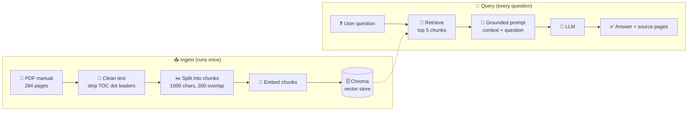
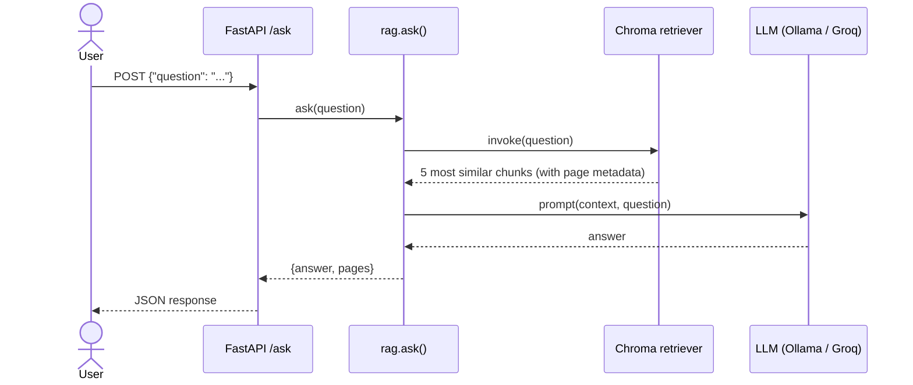
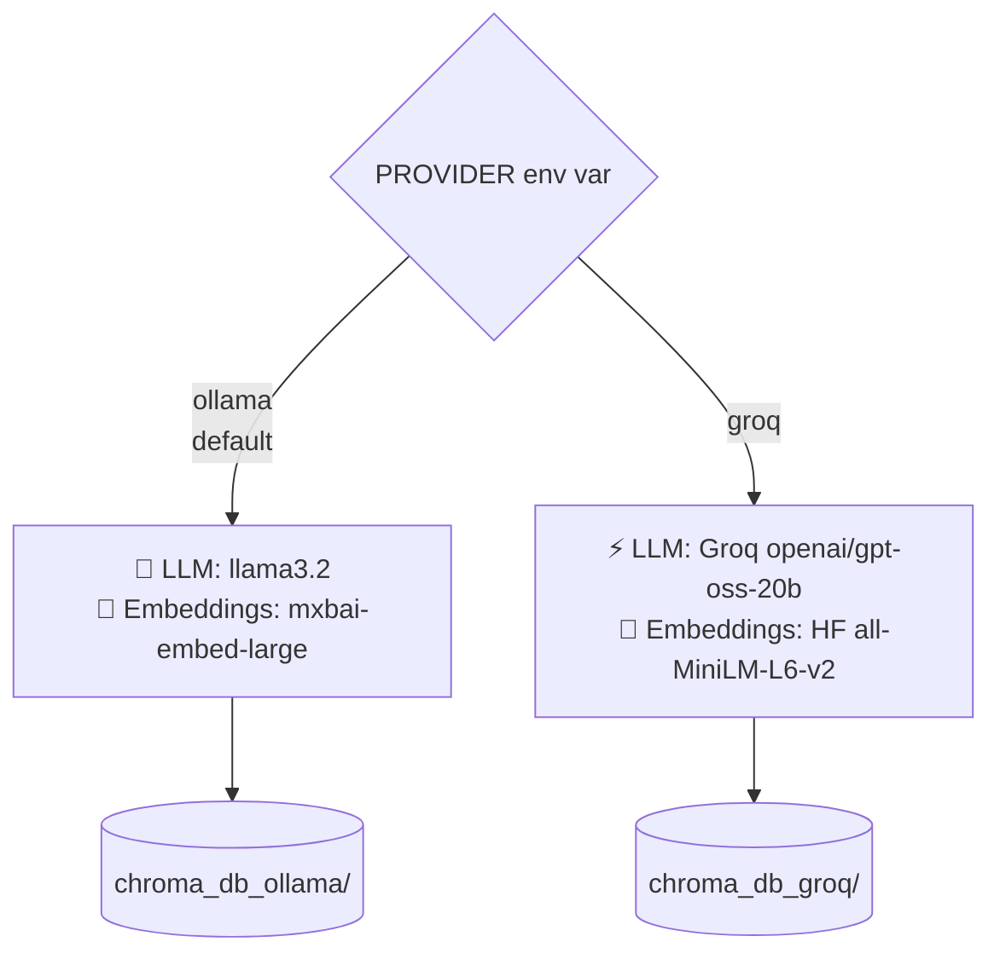

# 🚛 Commercial Driver's Manual RAG Chatbot

Ask questions in plain English about a **284-page commercial driver licensing manual** and get answers grounded in the document, **with the page numbers they came from**.

Built with **LangChain**, **Chroma**, and **FastAPI**. It runs **fully local with Ollama** or **in the cloud with Groq**, and you switch between them with one environment variable.

```text
Enter your question (or 'quit' to exit): What should I check during a pre-trip brake inspection?

Check that the parking brake holds the vehicle, test the service brakes at low speed,
and for air brakes verify the air pressure build-up rate and low-pressure warning...

Sources: pages [67, 68, 142]
```

---

## ✨ Features

- 📄 **Retrieval-Augmented Generation (RAG)**: answers come from the manual, not from what the model happens to remember.
- 🔎 **Page citations**: every answer lists the source pages so you can check it.
- 🛑 **Grounded prompt**: if the answer isn't in the manual, the model says it doesn't know instead of guessing.
- 🔀 **Two providers, one codebase**:
  - `ollama`: 100% local, free, and private.
  - `groq`: cloud LLM plus lightweight embeddings, so it runs on free hosting with no GPU.
- 💾 **Persistent vector index**: the PDF is embedded once and reused on later runs.
- 🌐 **REST API**: a FastAPI `POST /ask` endpoint with CORS configured for a web frontend.
- 🐳 **Docker-ready**: a slim image with CPU-only PyTorch, ready for Hugging Face Spaces or any container host.

---

## 🧠 How It Works

### The big picture



### Request lifecycle



### Switching providers



> 💡 **Why a separate index per provider?** Each embedding model produces vectors in its own space and with its own dimensions. A question embedded with MiniLM can't be compared against chunks embedded with mxbai, so each provider keeps its own Chroma database.

---

## 🗂️ Project Structure

```text
.
├── vector.py         # Ingestion: load PDF → clean → chunk → embed → Chroma; exposes `retriever`
├── rag.py            # Prompt + LLM chain; `ask(question)` → {answer, pages}
├── main.py           # Interactive command-line chat
├── app.py            # FastAPI server with POST /ask
├── Dockerfile        # Container for cloud deployment (Groq mode, port 7860)
└── requirements.txt
```

---

## 🚀 Getting Started

### 1. Clone and install

```bash
git clone https://github.com/momame/langchain-rag-pdf-chatbot.git
cd langchain-rag-pdf-chatbot
python -m venv venv
source venv/bin/activate        # Windows: venv\Scripts\activate
pip install -r requirements.txt
```

### 2. Add the PDF

The manual is **not included in the repo** (it's large and ignored by git). Put your copy in the project root as:

```text
drive_commercial_veh_full.pdf
```

> Any PDF works. Rename it to that filename and update the prompt in `rag.py` to match your subject.

### 3a. Run locally with Ollama 🦙 (free, private)

Install [Ollama](https://ollama.com), then pull the models:

```bash
ollama pull llama3.2
ollama pull mxbai-embed-large
```

```bash
python main.py
```

### 3b. Run with Groq ⚡ (fast, no GPU)

Get a free API key at [console.groq.com](https://console.groq.com):

```bash
export PROVIDER=groq
export GROQ_API_KEY=your_key_here
# optional: export GROQ_MODEL=openai/gpt-oss-20b
python main.py
```

> ⏳ The **first run** builds the vector index, which can take a few minutes. After that, startup is quick.

---

## 🌐 REST API

Start the server:

```bash
uvicorn app:app --reload --port 8000
```

Ask a question:

```bash
curl -X POST http://localhost:8000/ask \
  -H "Content-Type: application/json" \
  -d '{"question": "What is the minimum age for an interstate CDL?"}'
```

Response:

```json
{
  "answer": "You must be at least 21 years old to drive a commercial vehicle across state lines...",
  "pages": [12, 13]
}
```

Interactive API docs are at **http://localhost:8000/docs** (Swagger UI).

---

## 🐳 Docker

The vector index is **built into the image at build time**, so the container starts ready to answer. Provide the PDF in one of two ways:

```bash
# Option 1: PDF is in the project folder
docker build -t cdl-rag .

# Option 2: download the PDF during the build
docker build --build-arg PDF_URL=https://example.com/manual.pdf -t cdl-rag .
```

```bash
docker run -p 7860:7860 -e GROQ_API_KEY=your_key_here cdl-rag
```

The image defaults to `PROVIDER=groq` and installs **CPU-only PyTorch** to keep it small. This setup fits Hugging Face Spaces (port 7860). On Spaces, add `PDF_URL` as a **Variable** in the Space settings; Spaces passes variables to the build as build args.

> If no PDF is found, the **build** stops with a clear error, rather than the container crashing at startup.

---

## ⚙️ Configuration

| Variable       | Default               | Description                                   |
|----------------|-----------------------|-----------------------------------------------|
| `PROVIDER`     | `ollama`              | `ollama` (local) or `groq` (cloud)            |
| `GROQ_API_KEY` | none                  | Required when `PROVIDER=groq`                 |
| `GROQ_MODEL`   | `openai/gpt-oss-20b`  | Any chat model available on Groq              |
| `PDF_PATH`     | `drive_commercial_veh_full.pdf` | Path of the PDF to index              |
| `PDF_URL`      | none                  | Download the PDF from here if `PDF_PATH` is missing |

**Retrieval settings** (in code):

| Setting        | Value | Why                                                                |
|----------------|-------|--------------------------------------------------------------------|
| Chunk size     | 1000  | Large enough to hold a full rule or procedure                      |
| Chunk overlap  | 200   | Keeps sentences that cross a chunk boundary from being lost        |
| Top-k          | 5     | Enough context to answer, small enough to keep the prompt focused  |

---

## 🛠️ Tech Stack

| Layer         | Tools                                                          |
|---------------|----------------------------------------------------------------|
| Orchestration | LangChain (LCEL: `prompt \| model`)                            |
| Vector store  | Chroma (persistent)                                            |
| Embeddings    | Ollama `mxbai-embed-large` / HF `all-MiniLM-L6-v2`             |
| LLMs          | Ollama `llama3.2` / Groq `openai/gpt-oss-20b`                  |
| PDF parsing   | PyPDF via `PyPDFLoader`                                        |
| API           | FastAPI + Uvicorn                                              |
| Deployment    | Docker (Hugging Face Spaces compatible)                        |

---

## 🗺️ Roadmap

- [ ] Stream answers token by token
- [ ] Rerank retrieved chunks for better precision
- [ ] Evaluation set (question → expected pages) to measure retrieval hit rate
- [ ] Separate ingestion script so the API starts instantly
- [ ] Chat history for follow-up questions

---

## 👤 Author

**Matt Mehrpak**: [GitHub @momame](https://github.com/momame)

If this project helped you or gave you ideas, consider giving it a ⭐!
